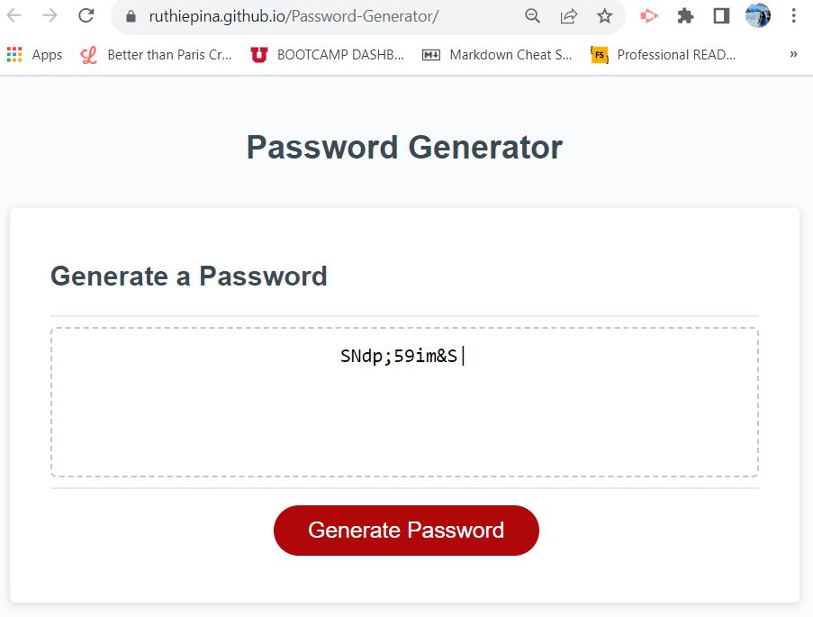

# Password-Generator

## Description

This app will allow a user to generate a random password based on criteria they have selected. It will run in the
browser, and will feature dynamically updated HTML and CSS powered by JavaScript code.

## Table of Contents

-  [About the Project](#about-the-project)
-  [User Story](#user-story)
-  [Acceptance Criteria](#acceptance-criteria)
-  [Problems Solved](#problems-solved)
-  [Access](#access)
-  [Credits](#credits)
-  [License](#license)

## About The Project

The motivation for this project was to be able to practice and implement what the Module 03: JavaScript taught me. I
built from the provided starter code to showcase my skills through the use of arrays, functions, objects, etc. to create
an interactive UI.

## User Story

-  AS AN employer with access to sensitive data
-  I WANT to randomly generate a password that meets certain criteria
-  SO THAT I can create a strong password that provides greater security

## Acceptance Criteria

-  GIVEN I need a new, secure password
-  WHEN I click the button to generate a password
-  THEN I am presented with a series of prompts for password criteria
-  WHEN prompted for password criteria
-  THEN I select which criteria to include in the password
-  WHEN prompted for the length of the password
-  THEN I choose a length of at least 8 characters and no more than 128 characters
-  WHEN asked for character types to include in the password
-  THEN I confirm whether or not to include lowercase, uppercase, numeric, and/or special characters
-  WHEN I answer each prompt
-  THEN my input should be validated and at least one character type should be selected
-  WHEN all prompts are answered
-  THEN a password is generated that matches the selected criteria
-  WHEN the password is generated
-  THEN the password is either displayed in an alert or written to the page

## Problems Solved

-  Enabled user prompting with validation.
-  Enabled loop to re-prompt user when input was invalid.
-  Randomly determined what character-set to use, based on user criteria input, to generate each character of the
   password.
-  Randomly determined what character of the selected character-set to use for the password.
-  Concatenated each generated character to form the password.
-  Created a data structure of type array to handle four objects that represented the criteria and its associated
   character-set.
-  Created small functions that performed a single task. The testing and debugging was easier this way.
-  Tested several scenarios and used the console to trace the results of each small piece of code that I was creating.
-  Properly commented and consolidated code.

## Access

The following link is the GitHub live URL of this project:

[Password Generator](https://ruthiepina.github.io/Password-Generator/).

Screenshot of the final project:

## Credits

Following sources are where I searched for syntax information, different JavaScript elements, troubleshooting code, etc.

-  https://www.w3schools.com
-  https://coding-boot-camp.github.io/full-stack/github/professional-readme-guide\
-  https://developer.mozilla.org/en-US/

## License

MIT License

---
